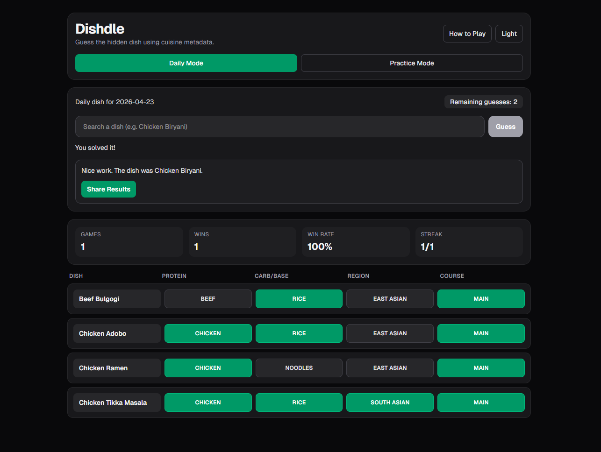

# Dishdle

Dishdle is a web-based "Cuisine Wordle" game where players guess a hidden dish using food attributes instead of letters.

Built with:
- Next.js (App Router)
- TypeScript
- Tailwind CSS

## App Screenshot

Add a screenshot file (for example `public/screenshot.png`) and keep/update this line:



## Features

- Daily mode with one deterministic dish per day
- Practice mode for unlimited replay
- 6 guesses per round
- Searchable autocomplete input restricted to valid dishes
- Attribute-based feedback for:
  - protein
  - carb/base
  - region
  - course type
- Feedback colors:
  - green = exact match
  - gray = no match
- Local persistence:
  - current game state (daily/practice separately)
  - player stats (games, wins, streaks)
  - theme preference (light/dark)
- Share results button with emoji grid output
- Responsive UI for desktop and mobile

## Getting Started

Install dependencies:

```bash
npm install
```

Run dev server:

```bash
npm run dev
```

Open [http://localhost:3000](http://localhost:3000).

## Scripts

- `npm run dev` - start local development server
- `npm run build` - create production build
- `npm run start` - run production server
- `npm run lint` - run ESLint

## Project Structure

```text
app/
  globals.css
  layout.tsx
  page.tsx
src/
  components/
    GameBoard.tsx
    GuessInput.tsx
    GuessRow.tsx
    Header.tsx
    InstructionsModal.tsx
    ResultBadge.tsx
  data/
    dishes.ts
  lib/
    game.ts
    storage.ts
  types/
    game.ts
```

## Where to Edit Things Later

- **Dish dataset**: edit `src/data/dishes.ts`
  - Add/remove dishes
  - Change dish metadata (`protein`, `carbBase`, `region`, `courseType`)
- **Game rules**: edit `src/lib/game.ts`
  - `MAX_GUESSES` controls number of attempts
  - `getDailyDish()` controls deterministic daily selection
  - `compareDishes()` controls attribute matching behavior
  - `buildShareText()` controls emoji share output
- **Persistence/stat behavior**: edit `src/lib/storage.ts`
- **UI components/layout**: edit files in `src/components/`

## Notes for Future Enhancements

The match architecture already includes a `partial` status in types and share logic, so you can add yellow "close match" rules later by extending `compareDishes()` without refactoring the UI model.

## Deploying

This app is ready to deploy on [Vercel](https://vercel.com/new):

1. Push repo to GitHub
2. Import project into Vercel
3. Deploy (no extra config required)
